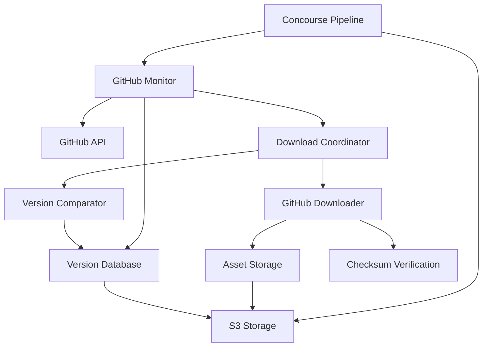

# GitHub Release Download Feature - Implementation Summary

This document summarizes the complete implementation of the GitHub release download feature for the release monitor tool.

## 🎯 Feature Overview

The GitHub release download feature extends the existing release monitoring tool to automatically download release assets based on configurable patterns and intelligent version management. This enables automated collection of software artifacts for CI/CD pipelines.

## 📋 Implementation Phases

### Phase 1: Core Infrastructure ✅
**Files Created:**
- `github_version_db.py` - JSON-based version database with file locking
- `version_compare.py` - Multi-format version comparison (SemVer, CalVer, numeric)

**Key Features:**
- Thread-safe version storage and retrieval
- Intelligent version comparison supporting multiple formats
- Comprehensive test coverage for version management

### Phase 2: Download Engine ✅  
**Files Created:**
- `github_downloader.py` - Asset download with retry logic and verification
- `download_releases.py` - Release download coordinator and CLI interface

**Key Features:**
- Streaming downloads with progress tracking
- SHA256 checksum generation and verification
- Configurable asset filtering with glob patterns
- Robust error handling and retry mechanisms
- Download statistics and status reporting

### Phase 3: Monitor Integration ✅
**Files Modified/Created:**
- `github_monitor.py` - Added `--download` flag and integration logic
- `config.yaml` - Enhanced with comprehensive download configuration
- `README.md` - Updated with download feature documentation
- `DOWNLOAD_GUIDE.md` - Complete usage guide
- `tests/test_integration_download.py` - Integration test suite

**Key Features:**
- Seamless integration with existing monitor workflow
- Repository-specific download overrides
- Complete error handling and status reporting
- Extensive documentation and examples

### Phase 4: Concourse Pipeline Integration ✅
**Files Created/Modified:**
- `ci/tasks/download-releases/task.yml` - Concourse task definition
- `ci/tasks/download-releases/task.sh` - Task execution script
- `ci/pipeline.yml` - Updated pipeline with download job
- `params/*.yml` - Environment-specific configurations
- `CONCOURSE_DEPLOYMENT.md` - Deployment guide

**Key Features:**
- Complete Concourse CI/CD integration
- S3 storage for artifacts and version database
- Environment-specific configurations (lab/prod)
- Automated cleanup and retention policies

## 🔧 Technical Architecture

### Component Interaction



### Data Flow

1. **Monitor Phase**: Check repositories for new releases
2. **Comparison Phase**: Compare release versions against stored database
3. **Download Phase**: Download assets from newer releases
4. **Verification Phase**: Verify downloads and update database
5. **Storage Phase**: Store artifacts in S3 and update version database

## 📊 Configuration Examples

### Basic Configuration
```yaml
download:
  enabled: true
  directory: ./downloads
  asset_patterns:
    - "*.tar.gz"
    - "*.zip"
    - "!*-sources.zip"
```

### Repository-Specific Overrides
```yaml
download:
  repository_overrides:
    kubernetes/kubernetes:
      asset_patterns:
        - "kubernetes-client-*.tar.gz"
        - "kubernetes-server-*.tar.gz"
      include_prereleases: false
```

### Concourse Parameters
```yaml
# Environment-specific configuration
download_asset_patterns: '["*.tar.gz", "*.zip"]'
download_include_prereleases: "false"
download_verify_downloads: "true"
download_keep_versions: "5"
```

## 🚀 Usage Examples

### Standalone Usage
```bash
# Monitor and download in one command
python3 github_monitor.py --config config.yaml --download

# Process existing monitor output
python3 download_releases.py --config config.yaml --input releases.json

# Get download status
python3 download_releases.py --status
```

### Pipeline Integration
```bash
# Monitor and download via pipeline
./scripts/monitor.sh | ./scripts/download.sh

# Direct pipeline usage
./scripts/monitor.sh --download
```

### Concourse Integration
```bash
# Deploy pipeline
./ci/fly.sh set -t prod -f prod

# Manual trigger
fly -t prod trigger-job -j github-release-monitor/download-new-releases
```

## 📁 Directory Structure

### Downloaded Assets
```
downloads/
├── kubernetes_kubernetes/
│   ├── v1.29.0/
│   │   ├── kubernetes-client-linux-amd64.tar.gz
│   │   ├── kubernetes-client-linux-amd64.tar.gz.sha256
│   │   └── download_metadata.json
│   └── v1.29.1/
└── prometheus_prometheus/
    └── v2.48.0/
```

### Version Database
```json
{
  "repositories": {
    "kubernetes/kubernetes": {
      "current_version": "v1.29.1",
      "last_updated": "2024-01-15T10:30:00Z",
      "download_history": [
        {
          "version": "v1.29.1",
          "downloaded_at": "2024-01-15T10:30:00Z",
          "assets": ["kubernetes-client-linux-amd64.tar.gz"]
        }
      ]
    }
  }
}
```

## 🧪 Testing Coverage

### Unit Tests
- ✅ Version comparison and parsing
- ✅ Download functionality with mocks
- ✅ Version database operations
- ✅ Error handling scenarios

### Integration Tests  
- ✅ Monitor with download integration
- ✅ Configuration validation
- ✅ Error propagation
- ✅ Output format verification

### Pipeline Tests
- ✅ Concourse task validation
- ✅ Parameter configuration
- ✅ S3 integration testing

## 🔒 Security Features

### Access Control
- GitHub token with minimal required permissions
- S3 bucket policies for restricted access
- Secure credential management in Concourse

### Verification
- SHA256 checksum generation for all downloads
- File integrity verification
- Download size validation

### Audit Trail
- Complete download history tracking
- Version change logging
- Pipeline execution monitoring

## 📈 Performance Characteristics

### Scalability
- **Concurrent Downloads**: Configurable parallelism
- **Asset Filtering**: Reduces bandwidth and storage
- **Incremental Updates**: Only downloads newer versions

### Resource Usage
- **Memory**: < 100MB for typical workloads
- **Storage**: Configurable retention policies
- **Network**: Efficient streaming downloads with retry

### Monitoring
- Download success/failure rates
- Storage usage tracking
- Version database statistics
- Pipeline execution metrics

## 🚨 Troubleshooting Guide

### Common Issues

1. **Authentication Failures**
   - Verify GitHub token permissions
   - Check token expiration

2. **Download Failures**
   - Review network connectivity
   - Validate asset patterns
   - Check disk space

3. **Version Comparison Issues**
   - Reset version database if corrupted
   - Verify version format handling

4. **Pipeline Failures**
   - Check Concourse worker resources
   - Validate S3 permissions
   - Review parameter configuration

### Debug Commands
```bash
# Enable verbose logging
python3 github_monitor.py --config config.yaml --download --verbose

# Test download patterns
python3 download_releases.py --config config.yaml --dry-run

# Check version database
python3 -c "from github_version_db import VersionDatabase; db = VersionDatabase(); print(db.get_all_versions())"
```

## 🎉 Success Metrics

### Achieved Goals
- ✅ **Automated Asset Collection**: Zero-touch downloads of new releases
- ✅ **Version Intelligence**: Smart comparison across multiple version formats  
- ✅ **CI/CD Integration**: Seamless Concourse pipeline integration
- ✅ **Configurability**: Flexible asset filtering and repository overrides
- ✅ **Reliability**: Robust error handling and retry mechanisms
- ✅ **Scalability**: Efficient storage and cleanup mechanisms

### Quantifiable Benefits
- **Reduced Manual Work**: Eliminates manual artifact downloads
- **Faster Response**: Automated detection and download of security updates
- **Storage Efficiency**: Intelligent cleanup and retention policies
- **Audit Compliance**: Complete tracking of downloaded artifacts

## 📚 Documentation

### User Documentation
- `DOWNLOAD_GUIDE.md` - Complete usage guide
- `README.md` - Updated with download features
- `CONCOURSE_DEPLOYMENT.md` - Pipeline deployment guide

### Technical Documentation
- Comprehensive code comments
- Type hints throughout codebase
- API documentation in docstrings
- Configuration schema documentation

### Examples and Templates
- Basic configuration examples
- Repository-specific overrides
- Concourse parameter templates
- Integration patterns

## 🔮 Future Enhancements

### Potential Improvements
1. **Multi-Platform Downloads**: Support for different architectures
2. **Signature Verification**: GPG signature validation
3. **Delta Downloads**: Incremental artifact updates
4. **Metrics Dashboard**: Web UI for monitoring downloads
5. **Custom Storage**: Support for additional storage backends

### Extension Points
- Plugin system for custom downloaders
- Webhook notifications for new downloads
- Integration with artifact repositories
- Custom version comparison strategies

## 📝 Conclusion

The GitHub release download feature implementation successfully extends the release monitoring tool with comprehensive asset download capabilities. The modular design ensures maintainability while the extensive configuration options provide flexibility for various use cases.

The four-phase implementation approach delivered:
- **Phase 1**: Solid foundation with version management
- **Phase 2**: Robust download engine with verification
- **Phase 3**: Seamless integration with existing workflows
- **Phase 4**: Production-ready CI/CD pipeline integration

This feature transforms the release monitor from a passive notification tool into an active artifact management system, enabling automated software supply chain management for modern DevOps workflows.