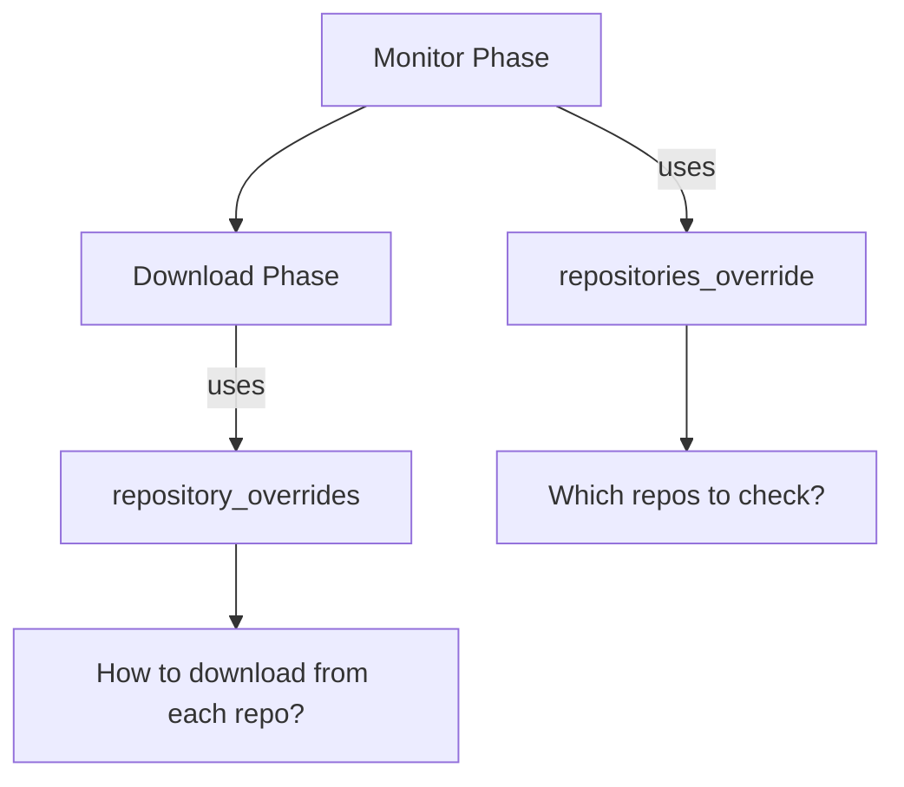

# JFrog Artifactory Integration Guide

Complete guide for setting up and using GitHub Release Monitor with JFrog Artifactory.

## Table of Contents

1. [Quick Start](#quick-start) - Get running in 5 minutes
2. [Docker Setup](#docker-setup) - Local development with Docker
3. [Configuration](#configuration) - Production and pipeline setup
4. [Downloading Releases](#downloading-releases) - Using the download scripts
5. [Management Scripts](#management-scripts) - Version database and repository cleanup
6. [Pipeline Integration](#pipeline-integration) - Concourse CI/CD setup
7. [Troubleshooting](#troubleshooting) - Common issues and solutions

---

## Quick Start

### Prerequisites

- Docker and Docker Compose (for local setup)
- Python 3 with `requests` library
- GitHub token for API access

### 1. Start Artifactory (Local Development)

```bash
# Start Artifactory with PostgreSQL
docker-compose -f docker-compose-artifactory.yml up -d

# Wait for it to be ready (5-10 minutes on first start)
./scripts/wait-for-artifactory.sh
```

### 2. Complete Setup Wizard

1. **Open Artifactory**: <http://localhost:8081>
2. **Login**: `admin` / `password`
3. **Set New Password**: Choose a secure password
4. **Base URL**: Set to `http://localhost:8081/artifactory`
5. **Proxy**: Skip proxy configuration
6. **Create Repository**:
   - Go to Administration → Repositories → Repositories
   - New Repository → Generic → Repository Key: `generic-releases`
   - Save & Finish

### 3. Generate API Key

1. **User Menu** → Generate API Key
2. **Copy** the generated key
3. **Save** it securely

### 4. Configure Environment Variables

```bash
# Artifactory configuration
export ARTIFACTORY_URL="http://localhost:8081/artifactory"
export ARTIFACTORY_REPOSITORY="generic-releases"
export ARTIFACTORY_API_KEY="your-generated-api-key"

# GitHub token (required)
export GITHUB_TOKEN="ghp_xxxxxxxxxxxxxxxxxxxx"
```

### 5. Test the Integration

```bash
# Install dependencies
source venv/bin/activate
pip install requests

# Test connection
python -c "
from github_version_artifactory import ArtifactoryVersionDatabase
import os
db = ArtifactoryVersionDatabase(
    base_url=os.environ['ARTIFACTORY_URL'],
    repository=os.environ['ARTIFACTORY_REPOSITORY'],
    api_key=os.environ['ARTIFACTORY_API_KEY']
)
print('✅ Connection successful!')
print('Version database:', db.load_versions())
"

# Run release monitor
python github_monitor.py --config ./config.yaml --download

# Download releases from Artifactory
./scripts/download-from-artifactory.sh --list
```

---

## Docker Setup

### Local Development Setup

For local development and testing, use the provided Docker Compose setup:

```bash
# Start all services
docker-compose -f docker-compose-artifactory.yml up -d

# Check status
docker-compose -f docker-compose-artifactory.yml ps

# View logs
docker-compose -f docker-compose-artifactory.yml logs -f artifactory

# Stop services
docker-compose -f docker-compose-artifactory.yml down
```

### Docker Compose Services

- **Artifactory**: JFrog Artifactory OSS with PostgreSQL backend
- **PostgreSQL**: Database for Artifactory
- **Setup Helper**: Automated setup and status checking

### Useful Commands

```bash
# Restart just Artifactory
docker-compose -f docker-compose-artifactory.yml restart artifactory

# Reset everything (⚠️ Destructive!)
docker-compose -f docker-compose-artifactory.yml down -v

# Shell into container
docker exec -it release-monitor-artifactory bash
```

---

## Configuration

### ⚠️ Important: Configuration Precedence

**Environment variables override config file settings!** The script auto-detects storage backends:

**Configuration Precedence (Highest to Lowest):**

1. **Environment Variables** (auto-detection) 🥇
2. **Config File Settings**
3. **Default Values**

**Auto-Detection Behavior:**

- If `ARTIFACTORY_URL` and `ARTIFACTORY_REPOSITORY` are set → **Artifactory storage is used**
- Even if `config.yaml` has `artifactory_storage.enabled: false`

**Avoid Confusion:**

- Unset Artifactory environment variables to use local storage
- Or use separate `.env` files for different scenarios
- See [Troubleshooting Guide](TROUBLESHOOTING.md#environment-variables-override-config-file-settings) for details

### Environment Variables

#### Required

```bash
# Artifactory endpoint (without repository path)
export ARTIFACTORY_URL="https://your-company.jfrog.io/artifactory"
export ARTIFACTORY_REPOSITORY="generic-releases"

# Authentication (choose one method)
export ARTIFACTORY_API_KEY="your-api-key"
# OR
export ARTIFACTORY_USERNAME="your-username"
export ARTIFACTORY_PASSWORD="your-password"
```

#### Optional

```bash
# SSL verification (default: true)
export ARTIFACTORY_SKIP_SSL_VERIFICATION="false"

# Path prefix in repository (default: release-monitor/)
export ARTIFACTORY_PATH_PREFIX="release-monitor/"
```

### Application Configuration

Edit `config.yaml`:

```yaml
download:
  enabled: true
  directory: ./downloads

  # Use Artifactory for version database and storage
  artifactory_storage:
    enabled: true
    base_url: "https://your-company.jfrog.io/artifactory"
    repository: "generic-releases"
    path_prefix: "release-monitor/"
    verify_ssl: true
    # Credentials read from environment variables
```

### Repository Structure

Artifacts are stored in this structure:

```sh
<repository>/
├── release-monitor/
│   ├── version_db.json                    # Version tracking database
│   ├── latest-releases.json               # Latest release metadata
│   └── release-downloads/                 # Downloaded artifacts
│       ├── kubernetes_kubernetes/         # Owner_repo format
│       │   ├── v1.28.0/
│       │   │   └── kubernetes-v1.28.0-linux-amd64.tar.gz
│       │   └── v1.28.1/
│       │       └── kubernetes-v1.28.1-linux-amd64.tar.gz
│       └── prometheus_prometheus/
│           └── v2.45.0/
│               └── prometheus-2.45.0.linux-amd64.tar.gz
```

---

## Downloading Releases

Once releases are uploaded to Artifactory, use the download scripts to retrieve them locally.

### Quick Download

```bash
# Download all releases
./scripts/download-from-artifactory.sh

# Download specific repository
./scripts/download-from-artifactory.sh --repo kubernetes/kubernetes

# List available repositories
./scripts/download-from-artifactory.sh --list
```

### Advanced Usage

```bash
# Download with pattern matching
./scripts/download-from-artifactory.sh --pattern "*.tar.gz"
./scripts/download-from-artifactory.sh --pattern "*linux-amd64*"

# Specify output directory
./scripts/download-from-artifactory.sh --output-dir ~/my-releases

# Combine options
./scripts/download-from-artifactory.sh \
  --repo kubernetes/kubernetes \
  --pattern "kubernetes-server-*.tar.gz" \
  --output-dir ./k8s-releases
```

### Python Script Direct Usage

For more control, use the Python script directly:

```bash
python3 scripts/download-from-artifactory.py \
  --url http://localhost:8081/artifactory \
  --repository generic-releases \
  --api-key "your-api-key" \
  --repo istio/istio \
  --pattern "istio-*-linux-amd64.tar.gz" \
  --output-dir ./istio-releases
```

### Script Options

```sh
--url URL                Artifactory base URL
--repository REPO        Repository name (default: generic-releases)
--username USER          Username for authentication
--password PASS          Password for authentication
--api-key KEY            API key for authentication
--repo OWNER/REPO        Download specific repository
--pattern PATTERN        File pattern to match (e.g., "*.tar.gz")
--output-dir DIR         Output directory (default: ./artifactory-downloads)
--list                   List available repositories without downloading
--no-verify-ssl          Skip SSL certificate verification
```

---

## Management Scripts

The repository includes several utility scripts for managing Artifactory storage and version database.

### Environment Setup

All scripts require these environment variables:

```bash
# Required for all scripts
export ARTIFACTORY_URL="http://localhost:8081/artifactory"
export ARTIFACTORY_REPOSITORY="generic-releases"
export ARTIFACTORY_API_KEY="your-api-key"

# Optional
export ARTIFACTORY_SKIP_SSL_VERIFICATION="true"  # For local/testing
```

### Version Database Management

#### View Version Database Contents

```bash
# Show current version database
python3 scripts/show-version-db-artifactory.py
```

**Example output:**

```sh
Version database from Artifactory
==================================================
Version: 2.0
Storage: artifactory
Created: 2025-01-15T14:30:00Z
Last updated: 2025-01-15T16:45:00Z

Tracked repositories:
--------------------------------------------------

  kubernetes/kubernetes:
    Current version: v1.29.1
    Created: 2025-01-15T14:30:00Z
    Last updated: 2025-01-15T16:45:00Z
    Download history (3 entries):
      - v1.29.1 at 2025-01-15T16:45:00Z
      - v1.29.0 at 2025-01-15T15:30:00Z
      - v1.28.6 at 2025-01-15T14:30:00Z

Total repositories: 1
```

#### Clear Entire Version Database

```bash
# Clear all version tracking (forces re-download of everything)
python3 scripts/clear-version-db-artifactory.py
```

**⚠️ Warning:** This will force the next pipeline run to download ALL releases as if they were new.

#### Clear Specific Repository

```bash
# Force re-download of a specific repository
python3 scripts/clear-version-entry-artifactory.py prometheus/prometheus
```

**Example output:**

```sh
Connecting to Artifactory at http://localhost:8081/artifactory...
Downloading version database from: http://localhost:8081/artifactory/generic-releases/release-monitor/version_db.json
Downloaded version database from Artifactory
Successfully removed prometheus/prometheus (was at version v2.48.1)
Updated version database uploaded to Artifactory

Next pipeline run will re-download releases for prometheus/prometheus
```

### Repository Cleanup

#### Clean Up Downloaded Artifacts

```bash
# Show what would be deleted (safe preview)
python3 scripts/clean-artifactory-repository.py --releases-only --dry-run

# Delete only downloaded release files (keep database)
python3 scripts/clean-artifactory-repository.py --releases-only

# Delete everything including version database
python3 scripts/clean-artifactory-repository.py --all --dry-run
python3 scripts/clean-artifactory-repository.py --all
```

**Example output:**

```sh
Connecting to Artifactory: http://localhost:8081/artifactory
Repository: generic-releases

Scanning repository for artifacts...

Found 156 total artifacts:
  Version database: 1 files
  Monitor output: 1 files
  Release downloads: 154 files
  Other files: 0 files

Total repository size: 2.3 GB
Release downloads size: 2.3 GB

Plan: Delete 154 release download files (2.3 GB)
  Keeping version database files
  Keeping monitor output files

Files to delete:
  - release-downloads/kubernetes/kubernetes/v1.29.1/kubernetes-client-linux-amd64.tar.gz (28.4 MB)
  - release-downloads/kubernetes/kubernetes/v1.29.1/kubernetes-server-linux-amd64.tar.gz (428.7 MB)
  - release-downloads/prometheus/prometheus/v2.48.1/prometheus-2.48.1.linux-amd64.tar.gz (89.2 MB)
  [... more files ...]

This will permanently delete 154 files (2.3 GB)!
Are you sure? Type 'yes' to continue: yes

Deleting 154 artifacts...
Deleting: release-downloads/kubernetes/kubernetes/v1.29.1/kubernetes-client-linux-amd64.tar.gz (28.4 MB)
[... deletion progress ...]

Cleaning up empty folders...
Deleted empty folder: release-downloads/kubernetes/kubernetes/v1.29.1/
Deleted empty folder: release-downloads/kubernetes/kubernetes/
Deleted empty folder: release-downloads/kubernetes/
Deleted empty folder: release-downloads/prometheus/prometheus/v2.48.1/
Deleted empty folder: release-downloads/prometheus/prometheus/
Deleted empty folder: release-downloads/prometheus/

Cleanup complete:
  Successfully deleted: 154 files (2.3 GB)
  Cleaned up: 6 empty folders

Next pipeline run will re-download all releases
```

### Script Options

#### clean-artifactory-repository.py

```
--releases-only    Delete only downloaded release artifacts, keep database and monitor output
--all             Delete everything including version database and monitor output
--dry-run         Show what would be deleted without actually deleting
--help            Show help message
```

#### clear-version-entry-artifactory.py

```
Usage: python3 scripts/clear-version-entry-artifactory.py <owner/repo>

Arguments:
  owner/repo        Repository in format 'owner/repo' (e.g., 'kubernetes/kubernetes')
```

### Common Use Cases

#### Free Up Storage Space

```bash
# Preview cleanup
python3 scripts/clean-artifactory-repository.py --releases-only --dry-run

# Clean up old downloads but keep version tracking
python3 scripts/clean-artifactory-repository.py --releases-only
```

#### Force Re-download Everything

```bash
# Option 1: Clear version database only
python3 scripts/clear-version-db-artifactory.py

# Option 2: Full cleanup (database + artifacts)
python3 scripts/clean-artifactory-repository.py --all
```

#### Test Single Repository

```bash
# Clear one repository from tracking
python3 scripts/clear-version-entry-artifactory.py prometheus/prometheus

# Then trigger download job manually in Concourse
fly -t your-target trigger-job -j pipeline-name/force-download-repo \
  -v force_download_repo="prometheus/prometheus"
```

#### Pipeline Troubleshooting

```bash
# Check what's tracked
python3 scripts/show-version-db-artifactory.py

# See total repository usage
python3 scripts/clean-artifactory-repository.py --all --dry-run
```

### Script Safety Features

- **Dry run mode**: Preview operations without making changes
- **Confirmation prompts**: Require typing 'yes' for destructive operations
- **Empty folder cleanup**: Automatically removes empty directories
- **Progress reporting**: Shows detailed progress and statistics
- **Error handling**: Graceful failure handling with detailed error messages

---

## Pipeline Integration

### Concourse Pipeline Setup

Use the Artifactory-specific pipeline configuration:

```bash
# Deploy pipeline
fly -t your-target set-pipeline \
  -p release-monitor-artifactory \
  -c ci/pipeline-artifactory.yml \
  -l params/global-artifactory.yml

# Unpause pipeline
fly -t your-target unpause-pipeline -p release-monitor-artifactory
```

### Parameter File

Copy and customize the parameter file:

```bash
cp params/global-artifactory.yml params/your-environment.yml
```

Edit with your settings:

```yaml
# GitHub configuration
github_token: ((github_token))

# JFrog Artifactory configuration
artifactory_url: https://your-company.jfrog.io/artifactory
artifactory_repository: generic-releases

# Authentication (store in Concourse secrets)
artifactory_api_key: ((artifactory_api_key))
# OR
artifactory_username: ((artifactory_username))
artifactory_password: ((artifactory_password))

# SSL configuration
artifactory_skip_ssl_verification: false
```

### Concourse Secrets

Store credentials securely:

#### Using Vault

```bash
vault kv put concourse/main/release-monitor-artifactory \
  artifactory_api_key="your-api-key"
```

#### Using CredHub

```bash
credhub set -n /concourse/main/release-monitor-artifactory/artifactory_api_key \
  -t value -v "your-api-key"
```

### Pipeline Jobs

The pipeline includes these jobs:

- **monitor-releases**: Check GitHub for new releases
- **download-releases**: Download and upload to Artifactory
- **check-version-database**: Inspect version database
- **reset-version-database**: Clear database (forces re-download)

---

## Troubleshooting

### Downloads Not Working Despite New Releases

**Issue:** Script finds new releases but downloads 0 files, shows "Skipping X: Version Y is not newer than Y"

**Root Cause:** Version database already contains these versions from previous runs.

**Quick Fix:**

```bash
# Clear Artifactory version database
python -c "
from github_version_artifactory import ArtifactoryVersionDatabase
import os
db = ArtifactoryVersionDatabase(
    base_url=os.environ['ARTIFACTORY_URL'],
    repository=os.environ['ARTIFACTORY_REPOSITORY'],
    api_key=os.environ.get('ARTIFACTORY_API_KEY'),
    verify_ssl=False
)
db.save_versions({'repositories': {}, 'metadata': {'version': '2.0'}})
print('✅ Version database cleared!')
"

# Then run downloads
rm -f release_state.json
python github_monitor.py --config ./config.yaml --download
```

### Artifactory Not Starting

**Symptoms**: Container fails to start or setup wizard doesn't load

**Solutions**:

- Check logs: `docker-compose -f docker-compose-artifactory.yml logs -f artifactory`
- Wait longer: First startup takes 5-10 minutes
- Check memory: Artifactory needs at least 2GB RAM
- Clear browser cache and try <http://localhost:8081/ui/>

### Authentication Errors (401/403)

**Symptoms**: HTTP 401 Unauthorized or 403 Forbidden errors

**Solutions**:

- Verify API key or username/password are correct
- Check user has proper permissions for the repository
- Test manually: `curl -H "X-JFrog-Art-Api: your-key" "http://localhost:8081/artifactory/api/repositories"`

### SSL Certificate Issues

**Symptoms**: SSL verification failures

**Solutions**:

- For testing: Set `ARTIFACTORY_SKIP_SSL_VERIFICATION=true`
- For production: Add CA certificate to system trust store
- Use `--no-verify-ssl` flag with download scripts

### Connection Errors

**Symptoms**: Cannot connect to Artifactory

**Solutions**:

- Check URL format: should end with `/artifactory` (no trailing slash)
- For Docker: Ensure port 8081 is accessible
- Check firewall and proxy settings
- Verify Artifactory is running: `curl http://localhost:8081/artifactory/api/system/ping`

### No Artifacts Found

**Symptoms**: Download scripts find no repositories or files

**Solutions**:

- Verify releases have been uploaded by the pipeline
- Check repository name matches pipeline configuration
- Use `--list` to see what's available
- Check path prefix setting (default: `release-monitor/release-downloads/`)

### Repository Not Found (404)

**Symptoms**: Repository doesn't exist errors

**Solutions**:

- Create the repository in Artifactory UI:
  - Administration → Repositories → Repositories
  - New Repository → Generic → Repository Key: `generic-releases`
- Check repository name in configuration matches exactly
- Verify user has access to the repository

### Performance Issues

**Symptoms**: Slow uploads/downloads or timeouts

**Solutions**:

- Use Artifactory instances close to your network
- Check available bandwidth and storage space
- Monitor repository size and consider cleanup policies
- Use connection pooling for multiple operations

### Debug Mode

Enable detailed logging:

```bash
export LOG_LEVEL="DEBUG"
python download_releases.py
```

### Manual Database Operations

```python
# Reset version database
from github_version_artifactory import ArtifactoryVersionDatabase
import os

db = ArtifactoryVersionDatabase(
    base_url=os.environ['ARTIFACTORY_URL'],
    repository=os.environ['ARTIFACTORY_REPOSITORY'],
    api_key=os.environ['ARTIFACTORY_API_KEY']
)

# Clear database (forces re-download)
empty_data = {'repositories': {}, 'metadata': {'version': '2.0'}}
db.save_versions(empty_data)
```

---

## Security Best Practices

1. **Use API Keys**: Prefer API keys over username/password
2. **Scope Permissions**: Create dedicated users with minimal required permissions
3. **Enable SSL**: Always use HTTPS in production
4. **Rotate Credentials**: Regularly update API keys and passwords
5. **Monitor Access**: Review Artifactory access logs
6. **Network Security**: Use private networks or VPNs where possible

---

## Migration from S3

To migrate from S3 to Artifactory:

1. **Export S3 version database**:

   ```python
   from github_version_s3 import S3VersionDatabase
   s3_db = S3VersionDatabase('your-s3-bucket')
   data = s3_db.load_versions()
   ```

2. **Import to Artifactory**:

   ```python
   from github_version_artifactory import ArtifactoryVersionDatabase
   art_db = ArtifactoryVersionDatabase('https://artifactory.example.com/artifactory', 'repo')
   art_db.save_versions(data)
   ```

3. **Update pipeline configuration** to use Artifactory parameters

4. **Optionally migrate artifacts** from S3 to Artifactory

---

## Configuration Parameters

Understanding the difference between `repositories_override` and `repository_overrides` is crucial for pipeline configuration.

### Parameter Overview

| Parameter | Pipeline Phase | Purpose | When to Use |
|-----------|----------------|---------|-------------|
| `repositories_override` | Monitor Phase | Controls **which repositories** to monitor | Change the list of repositories to track |
| `repository_overrides` | Download Phase | Controls **how to download** assets | Customize download settings per repository |

### Pipeline Flow



### repositories_override

**Controls:** Which repositories the monitor phase checks for new releases.

**Format:** JSON array of repository objects

**Use Cases:**

- **Production:** Override the default config.yaml repository list
- **Testing:** Monitor only specific repositories
- **Debugging:** Focus on a single problematic repository

**Examples:**

```yaml
# Pipeline parameter
repositories_override: |
  [
    {
      "owner": "kubernetes",
      "repo": "kubernetes",
      "asset_patterns": ["kubernetes-server-*.tar.gz"]
    },
    {
      "owner": "prometheus",
      "repo": "prometheus",
      "asset_patterns": ["prometheus-*.linux-amd64.tar.gz"]
    }
  ]
```

**Environment Variable Usage:**

```bash
export REPOSITORIES_OVERRIDE='[{"owner":"etcd-io","repo":"etcd","asset_patterns":["etcd-*.linux-amd64.tar.gz"]}]'
```

### repository_overrides

**Controls:** How to download assets from specific repositories during the download phase.

**Format:** JSON object with repository-specific download settings

**Use Cases:**

- **Per-repo patterns:** Different asset patterns for different repositories
- **Conditional downloads:** Some repos download source, others don't
- **Version limits:** Different keep_versions settings per repository
- **Version pinning:** Pin specific repositories to exact versions using `target_version`

**Examples:**

```yaml
# Pipeline parameter
repository_overrides: |
  {
    "kubernetes/kubernetes": {
      "asset_patterns": ["kubernetes-server-*.tar.gz", "kubernetes-client-*.tar.gz"],
      "include_prereleases": false,
      "keep_versions": 3
    },
    "istio/istio": {
      "asset_patterns": ["istio-*-linux-amd64.tar.gz"],
      "download_source": true,
      "fallback_only": true
    },
    "open-policy-agent/gatekeeper": {
      "target_version": "v3.19.1",
      "asset_patterns": ["*-linux-amd64.tar.gz"],
      "include_prereleases": false
    }
  }
```

#### Target Version Pinning

The `target_version` field allows you to pin a repository to a specific release version, bypassing the normal "latest release" logic.

**When to use:**

- **Stability:** Pin production systems to known-good versions
- **Testing:** Download specific versions for testing/validation
- **Rollback:** Revert to previous versions when needed
- **Compliance:** Ensure consistent versions across environments

**Features:**

- **Flexible format:** Accepts versions with or without 'v' prefix (`"v3.19.1"` or `"3.19.1"`)
- **Exact matching:** Only downloads the specified version
- **Override behavior:** Takes precedence over prerelease filtering and latest-release logic
- **Error handling:** Logs when target version is not found

**Example:**

```yaml
repository_overrides: |
  {
    "open-policy-agent/gatekeeper": {
      "target_version": "v3.19.1",
      "asset_patterns": ["*-linux-amd64.tar.gz"]
    },
    "kubernetes/kubernetes": {
      "target_version": "1.28.0",
      "asset_patterns": ["kubernetes-server-*.tar.gz"]
    }
  }
```

**Concourse Parameter Example:**

```bash
# Pin gatekeeper to specific version via pipeline parameter
fly set-pipeline -p release-monitor \
  -c ci/pipeline-artifactory.yml \
  -l params/global-artifactory.yml \
  -v repository_overrides='{
    "open-policy-agent/gatekeeper": {
      "target_version": "v3.19.1",
      "asset_patterns": ["*-linux-amd64.tar.gz"]
    }
  }'
```

### Common Scenarios

#### 1. Test Single Repository

```yaml
# Monitor only one repo
repositories_override: |
  [{"owner": "prometheus", "repo": "prometheus"}]

# No download overrides needed - uses default settings
repository_overrides: "{}"
```

#### 2. Production with Custom Download Settings

```yaml
# Monitor standard list from config.yaml
repositories_override: ""  # Empty = use config.yaml

# Customize download behavior per repo
repository_overrides: |
  {
    "kubernetes/kubernetes": {
      "asset_patterns": ["kubernetes-server-*.tar.gz"],
      "keep_versions": 5
    },
    "etcd-io/etcd": {
      "asset_patterns": ["etcd-*.linux-amd64.tar.gz"],
      "include_prereleases": true
    }
  }
```

#### 3. Development Testing

```yaml
# Test with subset of repos
repositories_override: |
  [
    {"owner": "etcd-io", "repo": "etcd"},
    {"owner": "prometheus", "repo": "prometheus"}
  ]

# Force re-download everything
repository_overrides: |
  {
    "etcd-io/etcd": {"force_download": true},
    "prometheus/prometheus": {"force_download": true}
  }
```

### Pipeline Job Usage

**Monitor Jobs:** Use `repositories_override`

- `monitor-releases`
- `check-releases` (in force-download-repo)

**Download Jobs:** Use `repository_overrides`

- `download-new-releases`
- `download-releases` (in force-download-repo)

### Parameter Validation

**repositories_override must be:**

- Valid JSON array
- Each item has `owner` and `repo` fields
- Optional fields: `asset_patterns`, `include_prereleases`, etc.

**repository_overrides must be:**

- Valid JSON object
- Keys are in format `owner/repo`
- Values are objects with download settings

### Troubleshooting

**Issue:** "Repository not found in override"

- Check that `repositories_override` includes the repository
- Verify JSON syntax is valid

**Issue:** "Downloads not using custom settings"

- Ensure `repository_overrides` key matches exactly: `owner/repo`
- Check that the repository was processed in monitor phase first

**Issue:** "Pipeline ignoring parameters"

- Verify parameter interpolation: `((parameter_name))`
- Check parameter file includes the parameter
- Confirm pipeline deployment used correct parameter file

---

## Support

For issues:

1. **📖 [Complete Troubleshooting Guide](TROUBLESHOOTING.md)** - Detailed solutions for common issues
2. Check this troubleshooting section above
3. Enable debug logging: `export LOG_LEVEL="DEBUG"`
4. Test Artifactory connectivity manually with curl
5. Verify repository permissions and configuration
6. Check Artifactory server logs (if you have admin access)

**Common Issues:**

- [Downloads not working despite new releases found](TROUBLESHOOTING.md#downloads-not-working)
- [Environment variables overriding config settings](TROUBLESHOOTING.md#environment-variables-override-config-file-settings)
- [Connection and authentication errors](TROUBLESHOOTING.md#downloads-fail-with-connection-errors)

For JFrog Artifactory-specific issues, consult the [JFrog Documentation](https://www.jfrog.com/confluence/display/JFROG/JFrog+Artifactory).
