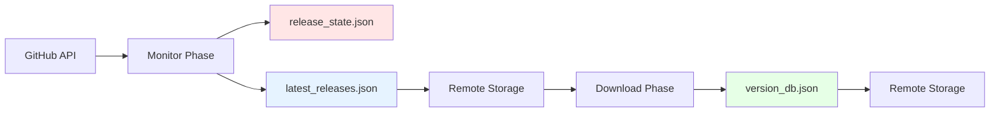
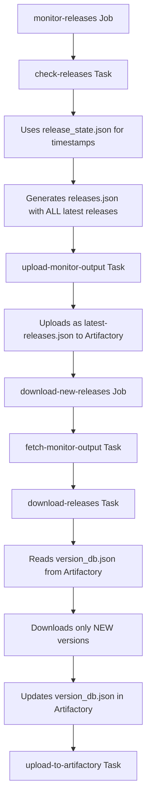
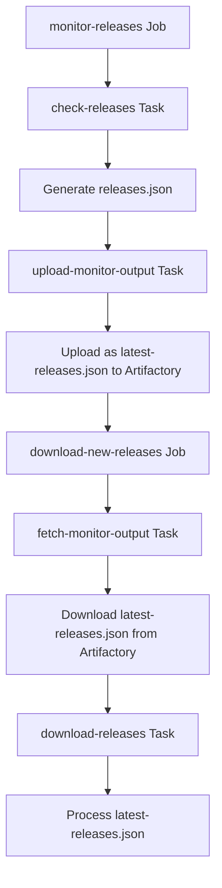
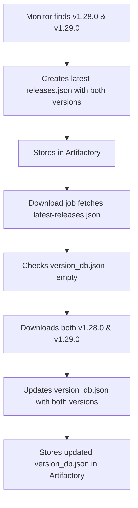
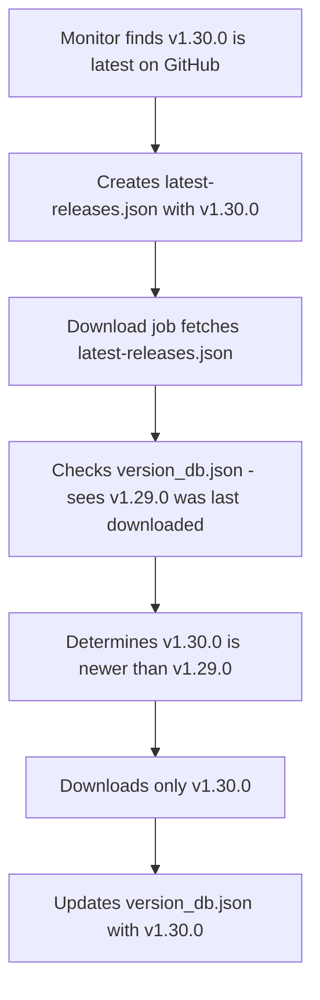
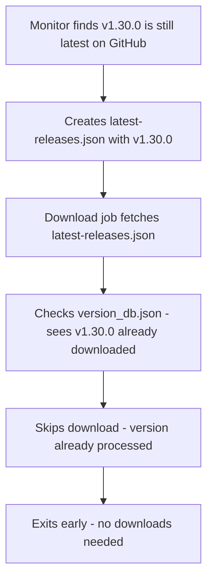

# Pipeline Files Explained

This document explains how the GitHub Release Monitor pipeline uses three critical files: `release_state.json`, `version_db.json`, and `latest_releases.json`. These concepts apply to all storage backends (Artifactory, S3, MinIO, and local file storage).

## 📊 Overview: Three Critical Pipeline Files

The pipeline relies on three distinct files for different aspects of its operation:

| File | Purpose | Storage Location | Updated By | Used By | Scope |
|------|---------|------------------|------------|---------|-------|
| **release_state.json** | Track GitHub API check timestamps | Local (ephemeral) | Monitor phase | Monitor phase | Single pipeline run |
| **latest_releases.json** | Transfer release data between jobs | Remote Storage¹ | Monitor phase | Download phase | Single pipeline run |
| **version_db.json** | Track downloaded versions | Remote Storage¹ | Download phase | Download phase | Persistent across runs |

¹ *Remote Storage can be: Artifactory, S3, MinIO, or local filesystem depending on configuration*

### 🔄 Data Flow Through Pipeline



## How the Release State File (release_state.json) Gets Used

### 📋 **Purpose and Function**

The `release_state.json` file is used by the monitor phase to track when each repository was last checked via the GitHub API. This helps with:

- **Rate limiting management** - Avoid hitting GitHub API limits
- **Timestamp tracking** - Know when each repo was last queried
- **Pipeline efficiency** - Skip recently checked repositories if needed

### 📂 **File Structure and Location**

**Storage Location:**
- **Local only** - Not stored in Artifactory
- **Path**: Specified by `--state-file` parameter (default: `release_state.json`)
- **Lifetime**: Single pipeline run (ephemeral)

**File Structure:**

```json
{
  "repositories": {
    "kubernetes/kubernetes": {
      "last_checked": "2025-08-04T10:00:00Z"
    },
    "prometheus/prometheus": {
      "last_checked": "2025-08-04T10:01:00Z"
    }
  },
  "last_run": "2025-08-04T10:01:00Z"
}
```

### 🔧 **Usage in Pipeline**

**In monitor-releases job:**

```bash
# ci/tasks/check-releases/task.sh
./scripts/monitor.sh \
  --config "$CONFIG_FILE" \
  --state-file "$STATE_FILE" \  # Default: /tmp/release-state/release_state.json
  --output /release-output/releases.json
```

**Key Operations:**
1. **Load existing state** - Check when repos were last queried
2. **Update timestamps** - Record current check time
3. **Save state** - Write back to file for next run

### ⚠️ **Important Notes**

- **Not used for version tracking** - Only tracks check timestamps
- **Not persisted** - Lost between pipeline runs
- **Not shared** - Each pipeline run has its own state
- **Optional** - Can be bypassed with `--force-check` flag

## How the Version Database (version_db.json) Gets Used

### 🏗️ **Pipeline Architecture Overview**

The pipeline uses a **shared version database stored in remote storage** to coordinate between different jobs and pipeline runs. The storage backend is determined by configuration (Artifactory, S3, MinIO, or local file). Here's the flow:



### 📊 **Version Database Structure & Location**

**Storage Locations by Backend:**

```sh
# Artifactory
<ARTIFACTORY_URL>/<REPOSITORY>/release-monitor/version_db.json

# S3/MinIO
s3://<BUCKET>/<PREFIX>/version_db.json

# Local File
<DOWNLOAD_DIR>/version_db.json
```

**Examples:**
```sh
# Artifactory
http://localhost:8081/artifactory/generic-releases/release-monitor/version_db.json

# S3
s3://release-monitor-bucket/release-monitor/version_db.json

# MinIO
http://localhost:9000/release-monitor-output/release-monitor/version_db.json

# Local
./downloads/version_db.json
```

**Database Structure:**

```json
{
  "metadata": {
    "version": "2.0",
    "storage": "artifactory", 
    "created_at": "2025-08-04T20:28:27.055835+00:00",
    "last_updated": "2025-08-04T20:28:27.055851+00:00"
  },
  "repositories": {
    "kubernetes/kubernetes": {
      "current_version": "v1.33.3",
      "created_at": "2025-08-04T20:28:27.055844+00:00", 
      "last_updated": "2025-08-04T20:28:27.055846+00:00",
      "download_history": [
        {
          "version": "v1.33.3",
          "downloaded_at": "2025-08-04T20:28:27.055849+00:00",
          "download_count": 2,
          "total_size": 512000000
        }
      ]
    }
  }
}
```

### 🔄 **How Each Pipeline Job Uses the Version Database**

#### 1. **monitor-releases Job**

- **Task:** `check-releases`
- **Usage:**
  - Uses `release_state.json` (local state file) to track timestamps
  - Does **NOT** use `version_db.json` at all
  - Checks GitHub for all releases (not filtered by version database)
  - Reports **all** latest releases found, regardless of download status

#### 2. **download-new-releases Job**  

- **Task:** `download-releases`
- **Usage:**
  - **Reads** `version_db.json` to check what's already downloaded
  - **Downloads** only releases that are newer than stored versions
  - **Updates** `version_db.json` with new version info after successful downloads
  - **Stores** download metadata (file count, size, timestamps)

#### 3. **Utility Jobs:**

- **check-version-database:** Displays current contents via `show-version-db-artifactory.py`
- **reset-version-database:** Clears entire database via `clear-version-db-artifactory.py`
- **force-download-repo:** Removes specific repository entry to force re-download

### ⚙️ **Storage Backend Auto-Detection**

The pipeline **automatically detects** which storage backend to use based on environment variables:

```bash
# Priority order (first match wins):

# 1. Artifactory (if URL and repository are set)
if [[ -n "$ARTIFACTORY_URL" && -n "$ARTIFACTORY_REPOSITORY" ]]; then
    USE_ARTIFACTORY_VERSION_DB="true"

# 2. S3 (if bucket is configured)
elif [[ -n "$VERSION_DB_S3_BUCKET" ]]; then
    USE_S3_VERSION_DB="true"

# 3. Local file storage (fallback)
else
    USE_LOCAL_VERSION_DB="true"
fi
```

**Environment Variables by Backend:**

**Artifactory:**
- `ARTIFACTORY_URL` - Base URL
- `ARTIFACTORY_REPOSITORY` - Repository name  
- `ARTIFACTORY_API_KEY` (or username/password)

**S3/MinIO:**
- `VERSION_DB_S3_BUCKET` - Bucket name
- `VERSION_DB_S3_PREFIX` - Path prefix
- `AWS_ACCESS_KEY_ID` / `AWS_SECRET_ACCESS_KEY`
- `S3_ENDPOINT` (for MinIO)

**Local File:**
- `DOWNLOAD_DIR` - Directory path

### 🔍 **Key Version Database Operations**

#### **Reading Versions (ArtifactoryVersionDatabase.get_current_version)**

```python
# In download_releases.py line 257
current_version = self.version_db.get_current_version(owner, repo)
```

#### **Updating Versions After Download**

```python  
# In download_releases.py line 328
self.version_db.update_version(owner, repo, tag_name, download_metadata)
```

#### **Version Comparison Logic**

The database enables **intelligent downloading** by:

1. **Preventing re-downloads** of already processed releases
2. **Supporting target version pinning** via repository overrides
3. **Tracking download history** for troubleshooting
4. **Enabling pipeline resumption** after failures

### 🛠️ **Management & Troubleshooting**

**View Database Contents:**

```bash
# Artifactory
make artifactory-view-db
python3 scripts/show-version-db-artifactory.py

# MinIO/S3
make view-version-db
python3 scripts/view-version-db.py

# Local file
cat downloads/version_db.json | jq
```

**Clear Entire Database (Force Re-download):**

```bash
# Artifactory
make artifactory-clear-db
python3 scripts/clear-version-db-artifactory.py

# MinIO/S3
make clear-version-db
python3 scripts/clear-version-db.py

# Local file
rm downloads/version_db.json
```

**Clear Specific Repository:**

```bash
# Artifactory
make artifactory-clear-entry REPO=kubernetes/kubernetes
python3 scripts/clear-version-entry-artifactory.py kubernetes/kubernetes

# MinIO/S3  
make clear-version-entry REPO=kubernetes/kubernetes
python3 scripts/clear-version-entry.py kubernetes/kubernetes

# Local file
# Manually edit the JSON file
```


### 🎯 **Critical Role in Pipeline Efficiency**

The version database is **essential** for:

1. **Preventing Duplicate Work** - Avoids re-downloading unchanged releases
2. **Pipeline State Persistence** - Maintains state across pipeline runs
3. **Parallel Pipeline Support** - Multiple pipelines can share the same database
4. **Targeted Re-downloads** - Clear specific repositories for testing
5. **Troubleshooting** - View what versions are tracked and when they were downloaded

Without the version database, the pipeline would re-download **all releases every time**, making it inefficient and wasteful of bandwidth and storage.

---

## How the `latest-releases.json` File is Used

The `latest-releases.json` file serves as the **crucial bridge** between the monitoring phase and the download phase in the Artifactory pipeline. Here's the complete flow:

### 🏗️ **Pipeline Data Flow Architecture**



### 📊 **File Structure & Location**

**Pipeline Storage Locations:**

- **Generated as:** `/release-output/releases.json` (monitor phase)
- **Stored in Artifactory as:** `<ARTIFACTORY_URL>/<REPO>/release-monitor/latest-releases.json`
- **Downloaded to:** `/tmp/monitor-output/latest-releases.json` (download phase)

**File Structure:**

```json
{
  "timestamp": "2025-08-04T20:28:27.055835+00:00",
  "total_repositories_checked": 4,
  "new_releases_found": 2,
  "releases": [
    {
      "repository": "kubernetes/kubernetes",
      "owner": "kubernetes", 
      "repo": "kubernetes",
      "tag_name": "v1.33.3",
      "name": "Release v1.33.3",
      "published_at": "2025-08-04T15:30:00Z",
      "html_url": "https://github.com/kubernetes/kubernetes/releases/tag/v1.33.3",
      "tarball_url": "https://api.github.com/repos/kubernetes/kubernetes/tarball/v1.33.3",
      "zipball_url": "https://api.github.com/repos/kubernetes/kubernetes/zipball/v1.33.3",
      "prerelease": false,
      "draft": false,
      "assets": [
        {
          "name": "kubernetes-server-linux-amd64.tar.gz",
          "browser_download_url": "https://github.com/kubernetes/kubernetes/releases/download/v1.33.3/kubernetes-server-linux-amd64.tar.gz",
          "size": 512000000,
          "content_type": "application/gzip"
        }
      ]
    }
  ]
}
```

### 🔄 **Step-by-Step Pipeline Usage**

#### **Phase 1: Monitor & Upload (monitor-releases job)**

1. **check-releases Task:**

   ```bash
   # Generates /release-output/releases.json
   ./scripts/monitor.sh --output /release-output/releases.json --format json
   ```

2. **upload-monitor-output Task:**

   ```bash
   # Uploads releases.json → latest-releases.json in Artifactory
   python3 scripts/upload-to-artifactory.py --releases-json
   ```

   **Key Upload Logic (`upload-to-artifactory.py` lines 95-144):**

   ```python
   # Reads from: RELEASES_INPUT_DIR/releases.json (default: /release-output)
   releases_file = Path(releases_input_dir) / 'releases.json'
   
   # Uploads to: release-monitor/latest-releases.json  
   artifactory_path = 'release-monitor/latest-releases.json'
   url = f"{artifactory_url}/{repository}/{artifactory_path}"
   ```

#### **Phase 2: Fetch & Download (download-new-releases job)**

1. **fetch-monitor-output Task:**

   ```bash
   # Downloads latest-releases.json from Artifactory
   python3 scripts/fetch-monitor-output.py --output-dir /monitor-output
   ```

   **Key Fetch Logic (`fetch-monitor-output.py` lines 49-65):**

   ```python
   # Downloads from: release-monitor/latest-releases.json
   url = f'{artifactory_url}/{repository}/release-monitor/latest-releases.json'
   
   # Saves to: /monitor-output/latest-releases.json
   output_file = output_path / 'latest-releases.json'
   ```

2. **download-releases Task:**

   ```bash
   # Processes the fetched monitor output
   python3 download_releases.py --input /tmp/monitor-output/latest-releases.json
   ```

   **Key Processing Logic (`download_releases.py` lines 188-195):**

   ```python
   def process_monitor_output(self, monitor_output: Dict[str, Any]):
       if not monitor_output.get('releases'):
           logger.info("No releases found in monitor output")
           return results
           
       logger.info(f"Processing {len(monitor_output['releases'])} releases from monitor")
       for release in monitor_output['releases']:
           result = self._process_single_release(release)
   ```

### 🎯 **Critical Role of latest-releases.json**

#### **1. Inter-Job Communication**

- **Decouples** monitoring from downloading
- **Enables** parallel pipeline execution
- **Provides** persistent state between pipeline runs

#### **2. Release Information Transfer**

The file contains **everything** needed for downloads:

- Repository details (`owner`, `repo`)
- Release metadata (`tag_name`, `published_at`)
- Asset information (`browser_download_url`, `size`)
- GitHub API URLs (`tarball_url`, `zipball_url`)

#### **3. Filtering & Decision Making**

The download phase uses this data to:

- **Compare** against version database
- **Skip** already-downloaded releases  
- **Apply** repository-specific overrides
- **Target** specific versions if configured

#### **4. Retry & Recovery**

- **Pipeline failures** can be resumed
- **Download jobs** can re-run without re-monitoring
- **Historical data** persists in Artifactory

### 🔧 **Environment Configuration**

**Upload Phase:**

```bash
RELEASES_INPUT_DIR=/release-output  # Source directory for releases.json
```

**Download Phase:**

```bash
OUTPUT_DIR=/monitor-output  # Target directory for latest-releases.json
```

**Artifactory Storage:**

```bash
ARTIFACTORY_URL=http://localhost:8081/artifactory
ARTIFACTORY_REPOSITORY=generic-releases
# Stored at: release-monitor/latest-releases.json
```

### 🚨 **Error Handling**

**Upload Validation (`upload-monitor-output/task.sh`):**

```bash
if [ ! -f "$releases_file" ]; then
    echo "ERROR: Could not find releases.json file at $releases_file"
    return false
fi
```

**Download Validation (`download-releases/task.sh`):**

```bash
if [[ ! -f "/tmp/monitor-output/latest-releases.json" ]]; then
    log_error "Monitor output file not found: /tmp/monitor-output/latest-releases.json"
    exit 1
fi
```

### 🔍 **Troubleshooting & Management**

**View Current Monitor Output:**

```bash
# From Artifactory directly
curl -H "Authorization: Bearer $ARTIFACTORY_API_KEY" \
  "$ARTIFACTORY_URL/$ARTIFACTORY_REPOSITORY/release-monitor/latest-releases.json"
```

**Debug Pipeline Issues:**

1. **Monitor Phase Issues:** Check if `releases.json` was generated
2. **Upload Issues:** Verify upload task succeeded and file exists in Artifactory
3. **Download Phase Issues:** Check if `latest-releases.json` was fetched correctly
4. **Processing Issues:** Examine `new_releases_found` count in the file

### 📋 **Key Differences from version_db.json**

| Aspect | latest-releases.json | version_db.json |
|--------|---------------------|-----------------|
| **Purpose** | Inter-job communication | Version state tracking |
| **Contains** | New releases found by monitor | Historical version data |
| **Updated by** | Monitor phase only | Download phase only |
| **Scope** | Single pipeline run | Persistent across runs |
| **Usage** | Input to download process | Prevents duplicate downloads |

### 🎯 **Summary**

The `latest-releases.json` file is the **essential data pipeline** that:

1. **Captures** monitor results with complete release metadata
2. **Persists** findings in Artifactory for reliability
3. **Provides** download tasks with all necessary information
4. **Enables** pipeline decoupling and parallel execution
5. **Supports** retry and recovery scenarios

Without this file, the download phase would have no way to know what releases were found by the monitoring phase, making the entire pipeline non-functional.

---

## Why the Pipeline Stores Both Files in Artifactory

The pipeline stores both files in Artifactory because they serve **fundamentally different purposes** in the pipeline architecture.

### 🎯 **Core Architectural Difference**

#### **latest-releases.json: "What to Process Now"**

- **Ephemeral data** - represents findings from a single monitor run
- **Pipeline communication** - passes data between jobs in the same pipeline run
- **Complete release metadata** - everything needed for downloading

#### **version_db.json: "What We've Already Done"**

- **Persistent state** - tracks what's been processed across all pipeline runs
- **Prevents duplicates** - avoids re-downloading the same versions
- **Historical record** - maintains audit trail of all downloads

### 🔄 **Detailed Pipeline Flow Analysis**

#### **Run #1: First Time**



**latest-releases.json after Run #1:**

```json
{
  "timestamp": "2025-08-04T10:00:00Z",
  "new_releases_found": 2,
  "releases": [
    {"tag_name": "v1.28.0", "repository": "kubernetes/kubernetes"},
    {"tag_name": "v1.29.0", "repository": "kubernetes/kubernetes"}
  ]
}
```

**version_db.json after Run #1:**

```json
{
  "repositories": {
    "kubernetes/kubernetes": {
      "current_version": "v1.29.0",
      "download_history": [
        {"version": "v1.28.0", "downloaded_at": "2025-08-04T10:05:00Z"},
        {"version": "v1.29.0", "downloaded_at": "2025-08-04T10:07:00Z"}
      ]
    }
  }
}
```

#### **Run #2: New Release Available**



**latest-releases.json after Run #2:**

```json
{
  "timestamp": "2025-08-04T14:00:00Z", 
  "new_releases_found": 1,
  "releases": [
    {"tag_name": "v1.30.0", "repository": "kubernetes/kubernetes"}
  ]
}
```

**version_db.json after Run #2:**

```json
{
  "repositories": {
    "kubernetes/kubernetes": {
      "current_version": "v1.30.0",
      "download_history": [
        {"version": "v1.28.0", "downloaded_at": "2025-08-04T10:05:00Z"},
        {"version": "v1.29.0", "downloaded_at": "2025-08-04T10:07:00Z"},
        {"version": "v1.30.0", "downloaded_at": "2025-08-04T14:05:00Z"}
      ]
    }
  }
}
```

#### **Run #3: No New Releases**



### 🔍 **Why Both Files Are Stored in Artifactory**

#### **1. Pipeline Reliability & Recovery**

**Without Artifactory Storage:**

```bash
# If latest-releases.json was only local:
monitor-job (worker-1) → generates latest-releases.json
# Worker-1 dies before download-job starts
download-job (worker-2) → ❌ No access to monitor results
```

**With Artifactory Storage:**

```bash
monitor-job (worker-1) → uploads latest-releases.json to Artifactory
# Worker-1 dies
download-job (worker-2) → ✅ Downloads latest-releases.json from Artifactory
```

#### **2. Concurrent Pipeline Support**

Multiple pipelines can run simultaneously:

```bash
# Pipeline A (main branch)
monitor-releases-A → latest-releases-A.json → downloads from A

# Pipeline B (feature branch) 
monitor-releases-B → latest-releases-B.json → downloads from B

# Both share same version_db.json for consistency
```

#### **3. Audit Trail & Debugging**

**latest-releases.json provides:**

- What releases were found at each run
- When the monitoring happened
- Complete metadata for troubleshooting

**version_db.json provides:**

- What has been successfully processed
- Download history and timing
- Current state for next run

### 📊 **Storage Locations by Backend**

**Artifactory Structure:**
```text
<ARTIFACTORY_URL>/<REPOSITORY>/release-monitor/
├── version_db.json              # Persistent state
├── latest-releases.json         # Latest monitor results  
└── release-downloads/           # Actual downloaded files
    └── kubernetes_kubernetes/v1.30.0/*.tar.gz
```

**S3/MinIO Structure:**
```text
s3://<BUCKET>/<PREFIX>/
├── version_db.json              # Persistent state
├── latest-releases.json         # Latest monitor results  
└── downloads/                   # Actual downloaded files
    └── kubernetes_kubernetes/v1.30.0/*.tar.gz
```

**Local File Structure:**
```text
<DOWNLOAD_DIR>/
├── version_db.json              # Persistent state
├── latest-releases.json         # Latest monitor results (if saved)
└── kubernetes_kubernetes/       # Actual downloaded files
    └── v1.30.0/*.tar.gz
```

### 🔄 **Different Update Patterns**

#### **latest-releases.json**

- **Written by:** Monitor phase only
- **Read by:** Download phase only  
- **Frequency:** Every pipeline run
- **Overwrites:** Previous content completely

#### **version_db.json**

- **Written by:** Download phase only
- **Read by:** Both monitor and download phases
- **Frequency:** Only when downloads occur
- **Updates:** Incrementally adds new versions

### 🛠️ **What Happens If One Is Missing?**

#### **Missing latest-releases.json:**

```bash
download-job → ❌ Cannot determine what to download
# Pipeline fails - no way to know what monitor found
```

#### **Missing version_db.json:**

```bash
monitor-job → ❌ Cannot determine what's already downloaded  
# Results in re-downloading everything every time
download-job → ❌ Cannot prevent duplicate downloads
```

### 🎯 **Real-World Example: Pipeline Failure Recovery**

**Scenario:** Download job fails after processing 2 of 5 releases

**Without Artifactory storage:**

- Monitor results lost
- Must re-run entire pipeline
- Risk of duplicate work

**With Artifactory storage:**

```bash
# 1. Check what was supposed to be downloaded
curl $ARTIFACTORY_URL/generic-releases/release-monitor/latest-releases.json

# 2. Check what was actually downloaded  
curl $ARTIFACTORY_URL/generic-releases/release-monitor/version_db.json

# 3. Re-run download job - it will skip completed downloads
fly trigger-job -j pipeline/download-new-releases
```

### 📋 **Summary: Why Both Are Essential**

| Need | latest-releases.json | version_db.json |
|------|---------------------|-----------------|
| **Inter-job communication** | ✅ Primary purpose | ❌ Not designed for this |
| **Prevent duplicate downloads** | ❌ Only shows current findings | ✅ Primary purpose |
| **Pipeline recovery** | ✅ Enables restart from download phase | ✅ Tracks what's completed |
| **Audit trail** | ✅ What was found when | ✅ What was processed when |
| **State persistence** | ❌ Ephemeral per run | ✅ Persistent across runs |
| **Debugging** | ✅ Monitor phase issues | ✅ Download phase issues |

**Bottom Line:** Both files are necessary because they solve different problems in the pipeline architecture. Removing either would break critical functionality - `latest-releases.json` enables communication between phases, while `version_db.json` prevents duplicate work across runs.

---

## 📊 Comprehensive Comparison: All Three Pipeline Files

### **File Purposes at a Glance**

| Aspect | release_state.json | latest_releases.json | version_db.json |
|--------|-------------------|---------------------|-----------------|
| **Primary Purpose** | Track API check timestamps | Inter-job communication | Track downloaded versions |
| **Key Question Answered** | "When did we last check?" | "What did we find?" | "What have we downloaded?" |
| **Prevents** | API rate limit violations | Lost monitor results | Duplicate downloads |
| **Failure Impact** | None (optional file) | Pipeline breaks | Re-downloads everything |

### **Technical Characteristics**

| Characteristic | release_state.json | latest_releases.json | version_db.json |
|----------------|-------------------|---------------------|-----------------|
| **Format** | JSON | JSON | JSON |
| **Size** | Small (~1KB) | Medium (10-100KB) | Large (grows over time) |
| **Storage** | Local filesystem | Artifactory | Artifactory |
| **Persistence** | Ephemeral | Per pipeline run | Permanent |
| **Concurrency** | Not shared | Read-only sharing | Shared with locking |
| **Backup Needed** | No | No | Yes |

### **Usage Patterns**

| Pattern | release_state.json | latest_releases.json | version_db.json |
|---------|-------------------|---------------------|-----------------|
| **Created By** | github_monitor.py | github_monitor.py | download_releases.py |
| **Read By** | github_monitor.py | download_releases.py | download_releases.py |
| **Updated** | Every API check | Every monitor run | Every successful download |
| **Cleared** | Automatically | Overwritten each run | Manual intervention |
| **CLI Access** | None | Via curl/API | Via helper scripts |

### **Example Scenarios**

#### **Scenario 1: Fresh Pipeline Run**
- `release_state.json`: Empty or missing → Full API check
- `latest_releases.json`: Generated with all latest releases
- `version_db.json`: Empty → Download everything

#### **Scenario 2: Regular Daily Run**
- `release_state.json`: Has yesterday's timestamps → Normal API check
- `latest_releases.json`: Generated with current latest releases
- `version_db.json`: Has history → Download only new versions

#### **Scenario 3: Force Re-download**
- `release_state.json`: Ignored with --force-check
- `latest_releases.json`: Generated normally
- `version_db.json`: Cleared manually → Re-download everything

#### **Scenario 4: Pipeline Recovery**
- `release_state.json`: Lost → No impact
- `latest_releases.json`: In Artifactory → Can resume downloads
- `version_db.json`: In Artifactory → Knows what's already done

### **Best Practices**

1. **release_state.json**
   - Let it manage itself
   - Use `--force-check` when needed
   - Don't store in version control

2. **latest_releases.json**
   - Monitor for `new_releases_found: 0` (nothing to do)
   - Archive for audit trails if needed
   - Check size for large deployments

3. **version_db.json**
   - Back up before major changes
   - Use helper scripts for modifications
   - Monitor growth over time
   - Clear old entries periodically

### **Troubleshooting Guide**

| Problem | Check | Solution |
|---------|-------|----------|
| Downloads failing | latest_releases.json exists? | Check monitor job logs |
| Re-downloading everything | version_db.json corrupted? | Restore from backup |
| API rate limits | release_state.json timestamps | Wait or use --force-check |
| Missing releases | latest_releases.json content | Check monitor filters |
| Duplicate downloads | version_db.json versions | Clear specific entries |

### **Summary**

The three files work together to create an efficient, reliable pipeline:

- **release_state.json** → Protects against API abuse
- **latest_releases.json** → Enables job communication
- **version_db.json** → Prevents duplicate work

Each file has a specific role, and understanding their interactions is key to troubleshooting and optimizing the pipeline.
