# Concourse Pipeline Flowchart

## GitHub Release Monitor - S3-Compatible Pipeline

This flowchart shows how the Concourse pipeline works based on `pipeline-s3-compatible.yml`.

```mermaid
flowchart TD
    %% Resources
    Git[("🗂️ release-monitor-repo<br/>(Git Repository)")]
    Timer[("⏰ schedule-trigger<br/>(Every 1 hour)")]
    S3Output[("☁️ monitor-output<br/>(S3: latest-releases.json)")]
    
    %% Main Pipeline Flow
    Git --> MonitorJob
    Timer --> MonitorJob
    
    MonitorJob["🔍 monitor-releases<br/>Job"]
    MonitorJob --> CheckTask["📋 check-releases<br/>Task"]
    
    %% Check Releases Task Details
    CheckTask --> |"Environment:"| CheckEnv["🌐 GITHUB_TOKEN<br/>🌐 S3_ENDPOINT<br/>🌐 REPOSITORIES_OVERRIDE"]
    CheckTask --> CheckScript["📜 scripts/monitor.sh"]
    CheckScript --> GitHubAPI["🐙 GitHub API<br/>(Check repositories)"]
    CheckScript --> ReleaseOutput["📄 releases.json<br/>(New releases found)"]
    
    ReleaseOutput --> S3Output
    S3Output --> DownloadJob
    
    %% Download Job
    DownloadJob["⬇️ download-new-releases<br/>Job"]
    DownloadJob --> |"Triggered by"| S3Output
    DownloadJob --> |"Uses"| Git
    
    DownloadJob --> DownloadTask["📥 download-releases<br/>Task"]
    DownloadTask --> |"Environment:"| DownloadEnv["🌐 GITHUB_TOKEN<br/>🌐 VERSION_DB_S3_BUCKET<br/>🌐 S3_ENDPOINT<br/>🌐 ASSET_PATTERNS<br/>🌐 REPOSITORY_OVERRIDES"]
    
    DownloadTask --> DownloadScript["📜 download_releases.py"]
    DownloadScript --> S3VersionDB["☁️ S3 Version Database<br/>(mc or boto3)"]
    DownloadScript --> GitHubDownload["⬇️ Download Assets<br/>(GitHub Releases)"]
    
    GitHubDownload --> LocalFiles["📁 /tmp/downloads/<br/>(Downloaded files)"]
    LocalFiles --> UploadTask
    
    %% Upload Task
    UploadTask["☁️ upload-to-s3<br/>Task"]
    UploadTask --> |"Environment:"| UploadEnv["🌐 S3_ENDPOINT<br/>🌐 S3_BUCKET<br/>🌐 AWS_ACCESS_KEY_ID<br/>🌐 AWS_SECRET_ACCESS_KEY"]
    UploadTask --> UploadScript["📜 scripts/upload-to-s3.py<br/>(or upload-to-s3-mc.py)"]
    UploadScript --> S3Storage["☁️ S3 Release Storage<br/>(Artifacts bucket)"]
    
    %% Utility Jobs
    ClearDBJob["🗑️ clear-version-database<br/>Job (Manual)"]
    ClearDBJob --> ClearScript["📜 scripts/clear-version-db.py"]
    ClearScript --> S3VersionDB
    
    ForceDownloadJob["🔄 force-download-repo<br/>Job (Parameterized)"]
    ForceDownloadJob --> |"Parameter: REPO_NAME"| ClearRepoTask["🗑️ clear-repo-from-db<br/>Task"]
    ClearRepoTask --> ForceCheckTask["📋 check-releases<br/>Task (Force)"]
    ForceCheckTask --> ForceDownloadTask["📥 download-releases<br/>Task (Force)"]
    ForceDownloadTask --> ForceUploadTask["☁️ upload-to-s3<br/>Task (Force)"]
    
    %% Styling
    classDef resource fill:#e1f5fe,stroke:#01579b,stroke-width:2px
    classDef job fill:#f3e5f5,stroke:#4a148c,stroke-width:2px
    classDef task fill:#e8f5e8,stroke:#1b5e20,stroke-width:2px
    classDef script fill:#fff3e0,stroke:#e65100,stroke-width:2px
    classDef storage fill:#fce4ec,stroke:#880e4f,stroke-width:2px
    classDef env fill:#f1f8e9,stroke:#33691e,stroke-width:1px
    
    class Git,Timer,S3Output resource
    class MonitorJob,DownloadJob,ClearDBJob,ForceDownloadJob job
    class CheckTask,DownloadTask,UploadTask,ClearRepoTask,ForceCheckTask,ForceDownloadTask,ForceUploadTask task
    class CheckScript,DownloadScript,UploadScript,ClearScript script
    class S3VersionDB,GitHubAPI,GitHubDownload,S3Storage storage
    class CheckEnv,DownloadEnv,UploadEnv env
```



## Pipeline Components

### Resources
- **release-monitor-repo**: Git repository containing the code
- **schedule-trigger**: Timer that triggers monitoring every hour
- **monitor-output**: S3 bucket storing the latest monitoring results

### Jobs

#### 1. monitor-releases (Automatic - Hourly)
- **Trigger**: Timer (every hour)
- **Input**: Git repository
- **Task**: check-releases
- **Output**: S3 monitor-output (latest-releases.json)

#### 2. download-new-releases (Automatic - When new releases found)
- **Trigger**: New monitor-output
- **Input**: Git repository + monitor-output
- **Tasks**: 
  - download-releases (downloads assets to /tmp/downloads)
  - upload-to-s3 (uploads to S3 artifacts bucket)
- **Output**: Downloaded files in S3 storage

#### 3. clear-version-database (Manual)
- **Purpose**: Reset version tracking database
- **Task**: clear-version-db
- **Effect**: Forces re-download of all releases

#### 4. force-download-repo (Parameterized)
- **Purpose**: Force download specific repository
- **Parameter**: `force_download_repo` (e.g., "kubernetes/kubernetes")
- **Tasks**:
  - clear-repo-from-db (remove specific repo from version DB)
  - check-releases (check that specific repo)
  - download-releases (download if newer)
  - upload-to-s3 (upload to S3)

## Data Flow

1. **Monitoring Phase**:
   ```
   Timer → monitor-releases → GitHub API → releases.json → S3
   ```

2. **Download Phase**:
   ```
   S3 monitor-output → download-new-releases → GitHub Downloads → Local Files → S3 Storage
   ```

3. **Version Tracking**:
   ```
   S3 Version DB ← download_releases.py → GitHub API
   ```

## Environment Variables

### Key Configuration
- `REPOSITORIES_OVERRIDE`: JSON array to override monitored repositories
- `GITHUB_TOKEN`: GitHub API authentication
- `S3_ENDPOINT`: S3-compatible endpoint URL
- `S3_USE_MC`: Use MinIO client (mc) instead of boto3

### S3 Configuration
- `VERSION_DB_S3_BUCKET`: Bucket for version database
- `S3_BUCKET`: Bucket for release artifacts
- `S3_SKIP_SSL_VERIFICATION`: Skip SSL for S3-compatible services

## Script Integration

### Core Scripts
- `scripts/monitor.sh` → `github_monitor.py` (Repository monitoring)
- `download_releases.py` (Asset downloading with version tracking)
- `scripts/upload-to-s3.py` or `scripts/upload-to-s3-mc.py` (S3 uploads)

### Version Storage
- Uses S3-compatible storage for version database
- Supports both boto3 and MinIO client (mc) for better compatibility
- Automatic fallback between implementations